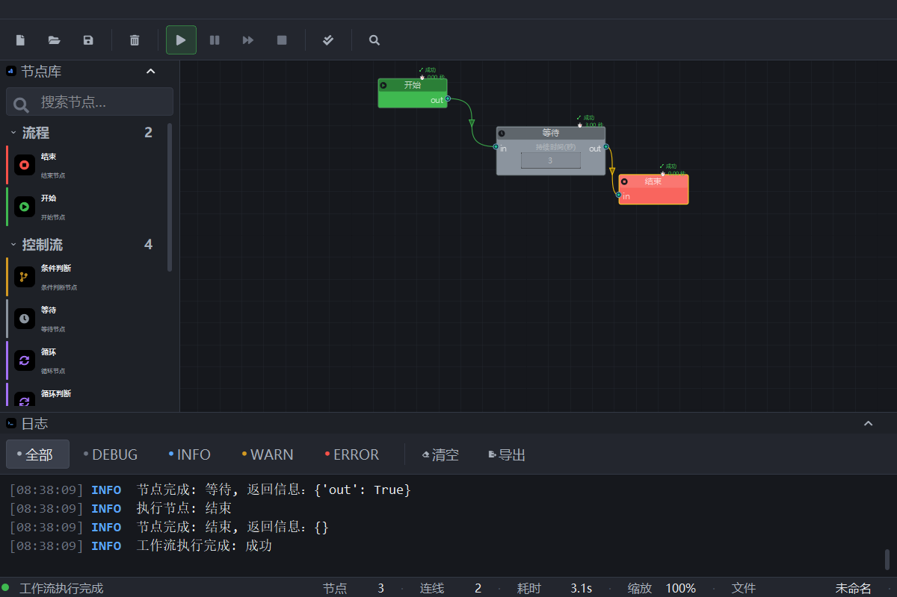
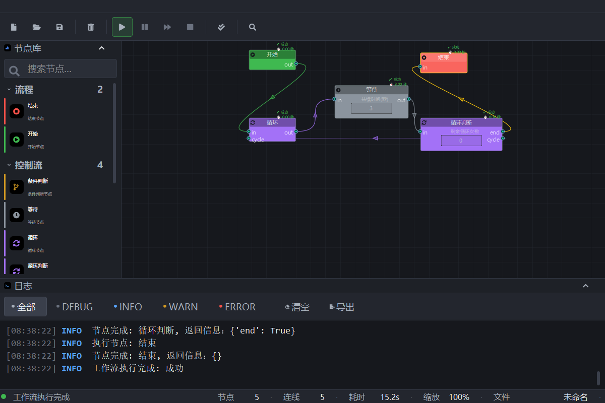

# 自动工作流设计器

基于 PyQt5 和 NodeGraphQt 构建的 Windows 窗口自动化工作流可视化编辑器，通过拖拽节点、连线编排自动化流程，并实际执行鼠标、键盘、窗口、图像识别等自动化操作。

## 功能特性

- **可视化节点编辑器**: 支持拖拽式节点创建和连接
- **流程控制节点**: 条件分支（基于安全表达式求值）、循环（次数控制）
- **窗口自动化节点**: 鼠标点击、键盘组合键、查找/激活窗口、图像识别定位
- **多线程执行引擎**: 工作流在子线程中运行，支持执行中暂停、恢复、终止
- **实时状态反馈**: 节点上直接显示"运行中 / 成功（含耗时）/ 失败"状态
- **工作流验证**: 执行前校验开始/结束节点唯一性及连线合法性
- **完整用户界面**: 菜单栏、工具栏、节点库、编辑画布、日志窗口、设置/关于对话框

## 系统要求

- Windows 系统（依赖 uiautomation、pywin32）
- Python 3.11+

## 安装依赖

```bash
pip install -r requirements.txt
```

核心依赖：PyQt5 5.15.11、QtAwesome 1.4.2（矢量图标）、NodeGraphQt 0.6.44、uiautomation 2.0.29、opencv-python、numpy、pywin32、pyperclip

> **运行提示**：请使用项目内的 `venv` 解释器启动。在 Windows Store 版 Python 下，
> NodeGraphQt 创建图对象会导致进程直接崩溃（无 Python 异常）。

## 项目结构

```
auto_workflow_project/
├── app/                        # 应用入口与全局配置
│   ├── main.py                 # 程序入口
│   ├── config.py               # 全局配置常量
│   └── logger.py               # 日志封装
├── core/                       # 核心业务层
│   ├── manager.py              # CoreManager：组装图管理器与执行器
│   ├── graph/                  # NodeGraphQt 图封装（包）
│   │   ├── manager.py          # 图生命周期与节点注册
│   │   ├── signals.py          # 结构信号集中管理
│   │   ├── serialization.py    # 工作流存取
│   │   ├── editing.py          # 撤销/重做/删除
│   │   └── clipboard.py        # 复制/粘贴
│   ├── executor.py             # 执行引擎（子线程运行、暂停/终止控制）
│   ├── validation.py           # 工作流结构校验
│   ├── workflow.py             # 工作流 JSON 数据模型
│   ├── context.py              # 全局执行上下文（节点间共享数据）
│   └── events.py               # 事件总线（PyQt5 信号解耦通信）
├── nodes/                      # 节点库（自动发现注册）
├── automation/                 # 窗口自动化引擎
│   ├── window_manager.py       # 窗口查找/激活（uiautomation）
│   ├── mouse_controller.py     # 鼠标操作
│   ├── keyboard_controller.py  # 键盘操作
│   ├── element_locator.py      # UI 元素定位
│   ├── image_finder.py         # 图像模板匹配（OpenCV）
│   └── utils.py                # 坐标、截图等工具
├── ui/                         # 用户界面层
│   ├── main_window.py          # 主窗口（面板组装、视图命令、状态接线）
│   ├── tokens.py               # 设计令牌：色板/字体/间距/节点分类（唯一色值来源）
│   ├── qss.py                  # 全局样式表（唯一 QSS 入口）
│   ├── icons.py                # qtawesome 矢量图标统一出口
│   ├── theme.py                # 界面状态（主题/网格/日志参数）
│   ├── actions.py              # 菜单栏与工具栏构建
│   ├── title_bar.py            # 面板自定义标题栏（可折叠）
│   ├── status_bar.py           # 状态栏（状态点 + 定宽指标分栏）
│   ├── nodes_panel.py          # 左侧节点库面板（搜索 + 分组 + 拖拽）
│   ├── node_graph_panel.py     # 节点图画布（配色/网格/连线着色/右键菜单）
│   ├── log_panel.py            # 日志处理器（级别徽章、过滤、行数上限）
│   ├── log_filter_bar.py       # 日志工具条（级别胶囊、清空、导出）
│   ├── log_search_bar.py       # 日志搜索栏（高亮与导航）
│   ├── file_actions.py         # 文件命令（新建/打开/保存/另存为/清空）
│   ├── execution_controller.py # 执行控制与按钮状态机
│   ├── settings_dialog.py      # 设置对话框
│   └── about_dialog.py         # 关于对话框
├── utils/                      # 工具类
│   ├── safe_eval.py            # 安全表达式求值（限定 AST）
│   └── workflow_utils.py       # 工作流验证/日志/报告
├── static/imgs/                # 图像识别模板图片
└── UI_DESIGN.md                # UI 设计规范与重设计说明
```

## 界面布局

深色专业工具风（设计规范见 `UI_DESIGN.md`），颜色只用于表达「节点分类」与「运行状态」两类语义。

- **菜单栏**: 文件（新建/打开/保存/另存为/退出）、编辑（撤销/重做/复制/粘贴/删除/清空）、
  运行（执行/验证/启动/暂停/恢复/终止）、视图（网格线、放大/缩小/重置缩放、面板显隐）、工具（设置/关于）
- **工具栏**: qtawesome 矢量图标按钮，分「文件 / 编辑 / 执行 / 校验 / 搜索」五组；
  启动按钮为绿色主按钮，暂停=琥珀、终止=红，禁用态自动灰化
- **左侧节点库**: 顶部搜索框（按名称/分类即时过滤），下方按「流程 / 控制流 / 自动化操作」分组、可折叠；
  每个条目带分类色条 + 分类色图标块 + 名称与描述，拖到画布即创建节点
- **中央画布**: 深色底 + 低对比网格线；节点标题条按分类着色并带矢量图标；
  连线颜色跟随其来源节点的分类色；右键弹出「分类 → 节点」两级菜单创建节点
- **底部日志**: 级别过滤胶囊（全部/DEBUG/INFO/WARN/ERROR）+ 清空 + 导出；
  每条日志为「时间戳 + 级别徽章 + 正文」三段式，ERROR/CRITICAL 正文用红色强调
- **状态栏**: 左侧状态圆点（空闲/运行中/暂停/失败）+ 状态消息；
  右侧定宽分栏指标：节点数 · 连线数 · 执行耗时 · 缩放比例 · 当前文件（未保存时带 `*`）

### 节点分类色

| 分组 | 分类 | 色值 | 覆盖节点 |
|------|------|------|----------|
| 流程 | 开始 | `#3fb950` 绿 | 开始 |
| 流程 | 结束 | `#f85149` 红 | 结束 |
| 控制流 | 条件判断 | `#d29922` 琥珀 | 条件判断 |
| 控制流 | 循环 | `#a371f7` 紫 | 循环、循环判断 |
| 控制流 | 等待 | `#8b949e` 灰 | 等待 |
| 自动化操作 | 输入操作 | `#58a6ff` 蓝 | 点击、键盘输入 |
| 自动化操作 | 窗口操作 | `#39c5cf` 青 | 查找窗口、激活窗口 |
| 自动化操作 | 图像识别 | `#db61a2` 洋红 | 查找图片 |

分类色唯一来源是 `ui/tokens.py`；节点类通过 `NODE_CATEGORY` / `NODE_ICON` 声明自己的归属。

## 节点类型

### 流程控制
- **开始节点**: 工作流唯一起始点
- **结束节点**: 工作流唯一终点
- **条件判断节点**: 根据条件表达式走 `true`/`false` 分支（支持以 `cond` 变量引用上游输入）
- **循环判断节点**: 按剩余次数控制循环，走 `cycle`/`end` 分支
- **循环承接节点**: 循环体的回流汇聚点
- **等待节点**: 延时指定秒数

### 窗口操作
- **查找窗口节点**: 按标题查找窗口，输出窗口对象
- **激活窗口节点**: 查找并激活窗口，句柄写入全局上下文

### 输入模拟
- **点击节点**: 在指定坐标 (x, y) 执行鼠标点击
- **键盘输入节点**: 模拟组合键输入（如 `ctrl+c`）

### 图像操作
- **查找图片节点**: 基于模板匹配在屏幕上定位图片，输出坐标

## 使用方法

1. 在项目根目录用 venv 解释器运行主程序:
   ```bash
   venv/Scripts/python.exe -m app.main      # Windows
   ```

2. 从左侧节点库拖拽节点到画布（也可在画布右键，用「分类 → 节点」两级菜单创建）
3. 节点多时可在节点库顶部搜索框按名称或分类过滤
4. 连接节点形成工作流（从开始节点到结束节点）
5. 选中节点后在属性栏配置参数（坐标、窗口标题、循环次数、表达式等）
6. F6 验证工作流，F5 执行工作流；执行中可暂停 / 恢复 / 终止
7. 「视图」菜单可开关网格线、缩放画布、隐藏节点库或日志面板
8. 日志面板支持级别过滤、关键词搜索（Ctrl+F）、清空与导出

## 快捷键

**文件**

- `Ctrl+N`: 新建工作流
- `Ctrl+O`: 打开工作流
- `Ctrl+S`: 保存工作流
- `Ctrl+Shift+S`: 另存为
- `Ctrl+Q`: 退出程序

**编辑**

- `Ctrl+Z`: 撤销
- `Ctrl+Y`: 重做
- `Ctrl+C` / `Ctrl+V`: 复制 / 粘贴选中节点
- `Delete`: 删除选中节点与连线

**运行**

- `F5`: 执行工作流（先验证，通过后启动）
- `F6`: 验证工作流

**视图与工具**

- `Ctrl++` / `Ctrl+-`: 画布放大 / 缩小
- `Ctrl+0`: 重置画布缩放
- `Ctrl+L`: 显示 / 隐藏日志面板
- `Ctrl+F`: 搜索日志
- `Ctrl+,`: 打开设置

## 测试案例

### 执行等待程序（等待3秒）

### 循环程序（循环3次，每次等待3秒）


## 许可证

MIT License
